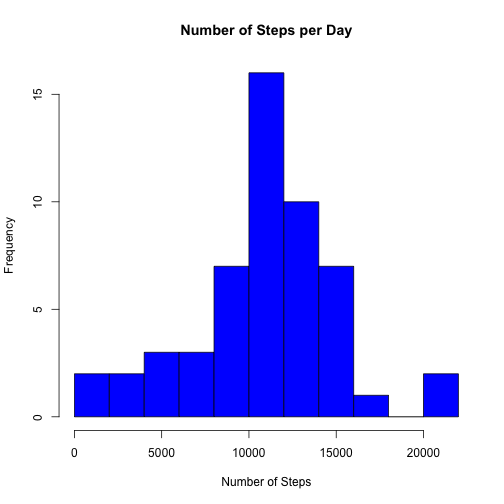

First load "knitr" and set the global options for knitr


```r
require(knitr)
opts_chunk$set(echo=TRUE)
```

##Loading and Processing the data
The data will be loaded from the zip file provided in the course, and the resulting csv will be stored inside a directory named "data" in your working directory.


```r
if(!file.exists("./data/activity.csv")){
        if(!file.exists("./data/")) dir.create("data")
        if(!file.exists("activity.zip")) stop("The data file does not exists in the directory, you must download the file activity.zip")
        unzip("activity.zip",exdir="data")
}
#Reading the dataset
data <- read.csv("./data/activity.csv")
```

##Question 1: What is the mean total number of steps taken per day?

1) Calculate the total number of steps taken per day


```r
steps_per_day <- tapply(data$steps,data$date,sum)
```

2) If you do not understand the difference between a histogram and a barplot, research the difference between them. Make a histogram of the total number of steps taken each day


```r
hist(steps_per_day,main="Number of Steps per Day",xlab="Number of Steps",breaks = 10,freq=TRUE,col="blue")
```

 

3) Calculate and report the mean and median of the total number of steps taken per day


```r
#The mean of the total number of steps taken each day is:
mean_steps <- mean(steps_per_day[!is.na(steps_per_day)])
mean_steps
```

```
## [1] 10766.19
```

```r
#The median of total number of steps taken each day is:
median_steps <- median(steps_per_day[!is.na(steps_per_day)])
median_steps
```

```
## [1] 10765
```

##Question 2: What is the average daily activity pattern?

1) Make a time series plot (i.e. type = "l") of the 5-minute interval (x-axis) and the average number of steps taken, averaged across all days (y-axis)


```r
mean_steps_per_interval <- tapply(data$steps,data$interval,mean,na.rm=TRUE)
plot(mean_steps_per_interval,type="l",col="blue",main="Average steps taken per 5-min interval")
```

 

2) Which 5-minute interval, on average across all the days in the dataset, contains the maximum number of steps?
To answer this question I used the function "which.max"

```r
x <- which.max(mean_steps_per_interval)
"The 5-min that contains, in average, the maximum number of steps is the interval number:"
```

```
## [1] "The 5-min that contains, in average, the maximum number of steps is the interval number:"
```

```r
x[[1]]
```

```
## [1] 104
```

##Question 3: Imputing missiong values

Note that there are a number of days/intervals where there are missing values (coded as NA). The presence of missing days may introduce bias into some calculations or summaries of the data.

1) Calculate and report the total number of missing values in the dataset (i.e.the total number of rows with NAs)

```r
n_missing_values <- length(data[is.na(data$steps),]$steps)
"Number of row with missing values"
```

```
## [1] "Number of row with missing values"
```

```r
n_missing_values
```

```
## [1] 2304
```

2) Devise a strategy for filling in all of the missing values in the dataset. The strategy does not need to be sophisticated. For example, you could use the mean/median for that day, or the mean for that 5-minute interval, etc.

As a strategy for filling in all the missing values, I am using the **mean** of each 5-minute interval accross all the dates of the test. I am building a funtion that loops through the dataset and each time it finds a NA in the steps field it calculates the mean of that 5-min interval across all the dates and replace the NA with the result. Then, using (dplyr) **mutate** function I replace the whole column steps with a new column that does not have NAs:


```r
require(dplyr)
stepsMissing <- function(d){
        vec <- vector("numeric",length=length(d$steps))
        
        for(i in seq_along(vec)){
                if(is.na(d$steps[i])){
                        # When the value of d$steps[i] == NA the function calculates the
                        # mean of that 5-min interval accross all the dates and replace
                        # the NA with the result
                        m <- tapply(d$steps,d$interval==d$interval[i],mean,na.rm=TRUE)
                        vec[i] <- m[[2]]
                }else{
                        vec[i] <- d$steps[i]
                }
        }
        vec
}

fixed_data <- mutate(data, steps = stepsMissing(data))
summary(fixed_data)
```

```
##      steps                date          interval     
##  Min.   :  0.00   2012-10-01:  288   Min.   :   0.0  
##  1st Qu.:  0.00   2012-10-02:  288   1st Qu.: 588.8  
##  Median :  0.00   2012-10-03:  288   Median :1177.5  
##  Mean   : 37.38   2012-10-04:  288   Mean   :1177.5  
##  3rd Qu.: 27.00   2012-10-05:  288   3rd Qu.:1766.2  
##  Max.   :806.00   2012-10-06:  288   Max.   :2355.0  
##                   (Other)   :15840
```

```r
head(fixed_data)
```

```
##       steps       date interval
## 1 1.7169811 2012-10-01        0
## 2 0.3396226 2012-10-01        5
## 3 0.1320755 2012-10-01       10
## 4 0.1509434 2012-10-01       15
## 5 0.0754717 2012-10-01       20
## 6 2.0943396 2012-10-01       25
```

3) Create a new dataset that is equal to the original dataset but with the missing data filled in.
- *The new data set was calculated in the last chunck and is named* **fixed_data** 

4) Make a histogram of the total number of steps taken each day and Calculate and report the mean and median total number of steps taken per day. Do these values differ from the estimates from the first part of the assignment? What is the impact of imputing missing data on the estimates of the total daily number of steps?


```r
steps_per_day_no_NAs <- tapply(fixed_data$steps,fixed_data$date,sum)

hist(steps_per_day_no_NAs,main="Number of Steps per Day (no NAs values)",xlab="Number of Steps",breaks = 10,freq=TRUE,col="red")
```

 

```r
#The mean of the total number of steps taken each day is (with NAs replaced by a value):
mean_steps_no_NAs <- mean(steps_per_day_no_NAs)
mean_steps_no_NAs
```

```
## [1] 10766.19
```

```r
#The median of total number of steps taken each day is (with NAs replaced by a value):
median_steps_no_NAs <- median(steps_per_day_no_NAs)
median_steps_no_NAs
```

```
## [1] 10766.19
```

The **mean** value does not differ from the one I got in the first part of the assigment (10766.19 steps by day). The **median** does differ a little: when the dataset has NAs values the median of the steps taken by day is 10765 vs 10766.19 when the dataset does not have NAs values. When the dataset does not have NAs values the mean and the median are equal.

## Question 4: Are there differences in activity patterns between weekdays and weekends?

For this part the **weekdays()** function may be of some help here. Use the dataset with the filled-in missing values for this part.

1) Create a new factor variable in the dataset with two levels – “weekday” and “weekend” indicating whether a given date is a weekday or weekend day.

I used the **ifelse()** function in order to test if each date in the dataset is either a weekend day or weekday day:


```r
fixed_data$wday <- ifelse(weekdays(as.Date(fixed_data$date)) %in% c("Saturday","Sunday"),"weekend","weekday")
fixed_data$wday <- as.factor(fixed_data$wday)
summary(fixed_data)
```

```
##      steps                date          interval           wday      
##  Min.   :  0.00   2012-10-01:  288   Min.   :   0.0   weekday:12960  
##  1st Qu.:  0.00   2012-10-02:  288   1st Qu.: 588.8   weekend: 4608  
##  Median :  0.00   2012-10-03:  288   Median :1177.5                  
##  Mean   : 37.38   2012-10-04:  288   Mean   :1177.5                  
##  3rd Qu.: 27.00   2012-10-05:  288   3rd Qu.:1766.2                  
##  Max.   :806.00   2012-10-06:  288   Max.   :2355.0                  
##                   (Other)   :15840
```

2) Make a panel plot containing a time series plot (i.e. type = "l") of the 5-minute interval (x-axis) and the average number of steps taken, averaged across all weekday days or weekend days (y-axis). See the README file in the GitHub repository to see an example of what this plot should look like using simulated data.


```r
require(dplyr)
require(ggplot2)

steps_mean_weekday <- tapply(fixed_data[fixed_data$wday=="weekday",]$steps,fixed_data[fixed_data$wday=="weekday",]$interval,mean)

steps_mean_weekend <- tapply(fixed_data[fixed_data$wday=="weekend",]$steps,fixed_data[fixed_data$wday=="weekend",]$interval,mean)

steps_mean_weekday <- as.data.frame(steps_mean_weekday)
steps_mean_weekday$wday <- "weekday"
steps_mean_weekday$interval <- c(1:288)
steps_mean_weekday <- select(steps_mean_weekday,interval, mean_steps_per_interval=steps_mean_weekday,wday)
head(steps_mean_weekday)
```

```
##    interval mean_steps_per_interval    wday
## 0         1              2.25115304 weekday
## 5         2              0.44528302 weekday
## 10        3              0.17316562 weekday
## 15        4              0.19790356 weekday
## 20        5              0.09895178 weekday
## 25        6              1.59035639 weekday
```

```r
steps_mean_weekend <- as.data.frame(steps_mean_weekend)
steps_mean_weekend$wday <- "weekend"
steps_mean_weekend$interval <- c(1:288)
steps_mean_weekend <- select(steps_mean_weekend,interval, mean_steps_per_interval=steps_mean_weekend,wday)
head(steps_mean_weekend)
```

```
##    interval mean_steps_per_interval    wday
## 0         1             0.214622642 weekend
## 5         2             0.042452830 weekend
## 10        3             0.016509434 weekend
## 15        4             0.018867925 weekend
## 20        5             0.009433962 weekend
## 25        6             3.511792453 weekend
```

```r
df_plot <- rbind(steps_mean_weekday,steps_mean_weekend)
p <- ggplot(df_plot,aes(df_plot$interval,df_plot$mean_steps_per_interval)) + geom_line(col="red") + facet_grid(wday ~ .) + ggtitle("Activity Pattern during the weekdays vs Activity Pattern during the weekend")
print(p)
```

 
